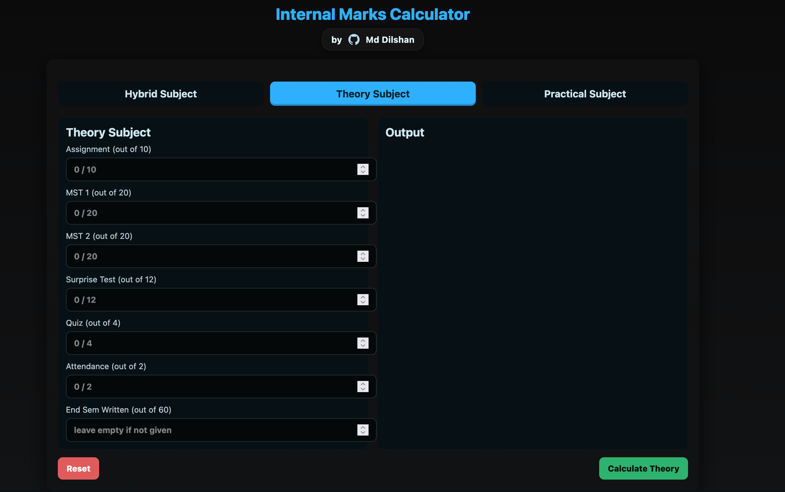

# 📘 Internal Marks Calculator
A clean and fast **Internal Marks Calculator** that helps students compute their internal assessment marks for:

- 📝 Theory subjects  
- 🧪 Practical subjects  
- 🔄 Hybrid (Theory + Practical)  
- 🎯 MSTs, Assignments, Experiments, Attendance & more  

---

---

## 🛠️ Features

- Toggle between **Theory**, **Practical**, and **Hybrid** modes  
- Calculate MST, written, assignment, experiment & attendance marks  
- Instant final internal score  
- Simple, clean, and responsive UI  
- Optimized for mobile & desktop  

---

## 🧾 Tech Stack

- **HTML**  
- **CSS**  
- **JavaScript**  

---

## 🚀 Try It Now

👉 **https://imdilshan.github.io/Internal-Marks-Calculator/**

---

## 📸 Preview

